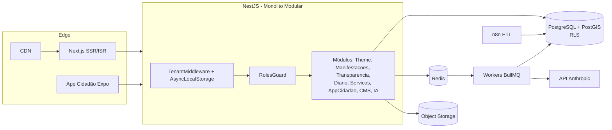
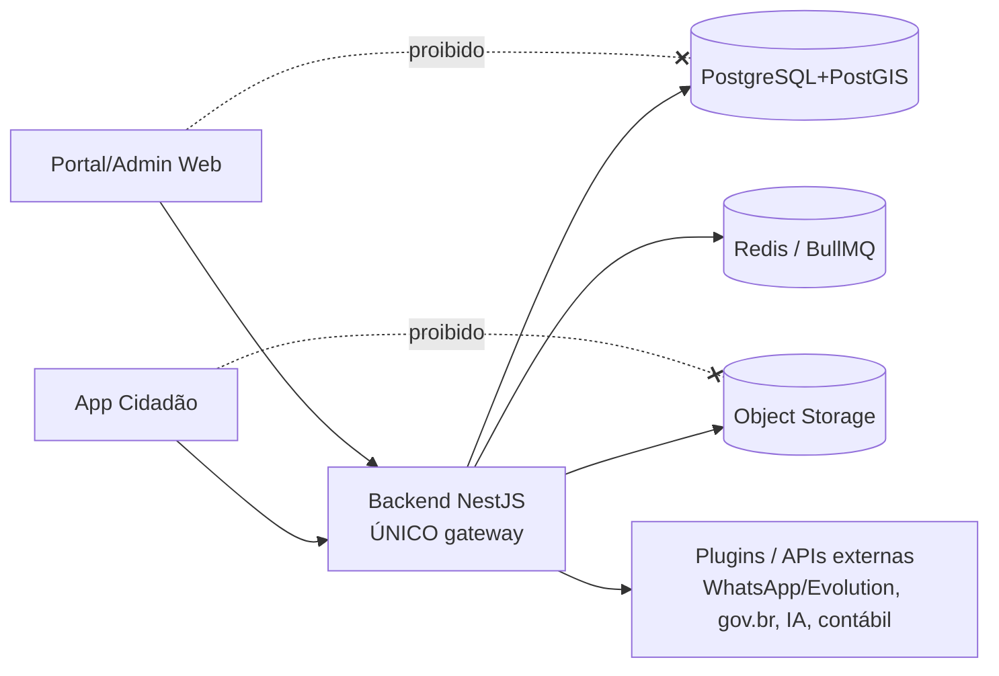

# 01 — Arquitetura

## Visão

Plataforma SaaS **multi-tenant** que entrega o portal completo de uma prefeitura (ESIC, Ouvidoria, Transparência, Diário Oficial, Serviços, CMS, App do Cidadão) a partir de **um único código** e **uma única infraestrutura**. Cada prefeitura é um *tenant* com domínio, identidade visual e conteúdo próprios.

## Princípios

1. **Isolamento no banco, não só no código** — Row Level Security garante que um tenant nunca veja dados de outro, mesmo diante de um bug na aplicação.
2. **Monólito modular antes de microsserviços** — fronteiras de módulo claras no NestJS; só extrai serviço quando a dor operacional justificar.
3. **Conformidade por design** — prazos legais, acessibilidade e LGPD são parte do modelo, não um adendo.
4. **Assíncrono para o que pode esperar** — filas (BullMQ) para SLA, notificações e integrações; n8n para ETL.
5. **Reversibilidade** — decisões caras/irreversíveis viram ADR.

## Componentes

## Multi-tenancy

- **Estratégia:** shared schema + `tenant_id` + RLS. Tenants de grande porte (capitais) podem ser promovidos a **schema dedicado** sem mudar a aplicação (mesma camada Prisma, mesma policy).
- **Resolução do tenant:** `TenantMiddleware` lê o `Host` (domínio próprio ou subdomínio) e guarda o `tenantId` em `AsyncLocalStorage`. O `PrismaService` injeta `app.current_tenant_id` em cada transação; as policies isolam os dados.
- **Plataforma:** super_admin e jobs de plataforma usam `prisma.platform()` (modo `app.is_platform = on`) para operar cross-tenant (ex.: registrar tenants).

## Camadas de segurança (independentes)

| Camada | Pergunta | Mecanismo |
|--------|----------|-----------|
| RBAC | O que você **pode fazer**? | `@Roles` + `RolesGuard` |
| RLS | O que você **pode ver**? | Policies no PostgreSQL |

## Fronteira de camadas (gateway único)

O backend é o **único** ponto de contato com dados e mundo externo. Regra estrita:

- **Frontend (Next.js) e App (Expo)** falam **somente** com a **API**.
- **Frontend/App não acessam** banco, storage, filas, plugins (ex.: WhatsApp/Evolution) nem APIs externas.
- **Somente o backend** acessa banco, storage, filas, plugins e APIs externas.
- Upload de arquivo (foto de chamado, anexo de manifestação, edição do Diário) vai **via API** (multipart); a API valida, grava no storage e guarda só a chave. **Não** há URL de upload assinada exposta ao cliente nem cliente de banco/storage no web/mobile.

Benefícios: superfície de ataque concentrada (validação, autorização, auditoria e LGPD num só lugar), segredos só no backend, e troca de provedores (storage/WhatsApp/IA) sem tocar no cliente.

## Decisões-chave

- **Prisma + RLS:** Prisma é a camada de query; RLS vive no SQL (Prisma não expressa policies). O `PrismaService` faz a ponte via `set_config` por transação. Ver [ADR 0001](adr/0001-multi-tenancy-rls.md).
- **Tema dinâmico:** design tokens (JSONB por tenant) → CSS variables injetadas no SSR → Tailwind lê `var(--*)`. Validação WCAG bloqueante.
- **FSM de manifestações:** tabela de transições declarativa + efeitos de SLA; histórico imutável de eventos.
- **n8n para ETL:** a integração com sistemas contábeis (transparência) é heterogênea por fornecedor; n8n isola essa complexidade fora do core.

## Estrutura de pastas

Ver `CLAUDE.md` (mapa do repositório). Módulos futuros encaixam no `AppModule` e reaproveitam tenant/RLS/RBAC/filas.
