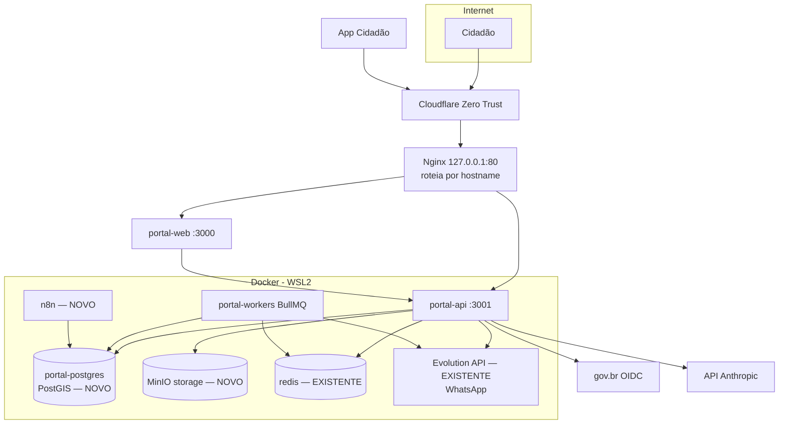

# 12 — Infraestrutura (Servidor Lidera)

Como o portal roda sobre a infraestrutura existente (**SRV-LIDERA-00**: Windows Server 2022 → WSL2/Ubuntu → Docker). O que **reusar**, o que **provisionar** e as armadilhas.

## Topologia de implantação



A fronteira de camadas vale aqui: **só a API/workers** tocam Postgres, MinIO, Redis, Evolution, gov.br e IA. Web e App entram apenas pela API, publicada via Nginx + Cloudflare ZT (sem abrir portas para a internet).

## Reusar (já existe no servidor)

| Recurso | Como usar no portal |
|---------|---------------------|
| **Redis 7** (`evolution-net`, hostname `redis`) | BullMQ + cache. **Use um DB Redis dedicado** (ex.: índice 0 ou 1) e **key prefix** `portal:` — o Evolution usa o DB 6; não colida. |
| **Evolution API** (WhatsApp) | Plugin de notificação por WhatsApp. A **fila `notificacoes`** chama o Evolution (`POST /message/sendText`, header `apikey`). Nunca pelo frontend. |
| **Nginx + Cloudflare ZT** | Publicar `portal-web` e `portal-api` como public hostnames no túnel ZT. Multi-tenant por Host continua: CF/Nginx roteiam o domínio da prefeitura para o web, que repassa o `Host` à API. |
| **Portainer / WSL auto-start / backups** | Operação e restart-always dos containers do portal. |

## Provisionar (falta no servidor)

1. **Postgres com PostGIS (dedicado ao portal).** O *Postgres Main* atual é `postgres:16-alpine` — **não tem PostGIS** (necessário para os chamados geo). Suba um container dedicado:
   ```bash
   docker run -d --name portal-postgres --restart=always \
     --network evolution-net \
     -e POSTGRES_DB=portal \
     -e POSTGRES_USER=portal_app \
     -e POSTGRES_PASSWORD='<defina-forte>' \
     -v portal_pg_data:/var/lib/postgresql/data \
     postgis/postgis:16-3.4
   ```
   Banco isolado do resto, com PostGIS e um papel de aplicação próprio. (Alternativa: instalar PostGIS no Main — não recomendado por acoplar o portal ao banco compartilhado.)

2. **Object storage (MinIO, S3-compatível).** Não há storage de objetos hoje (só FileBrowser para arquivos grandes). O portal precisa guardar fotos de chamados, anexos e edições do Diário:
   ```bash
   docker run -d --name portal-minio --restart=always \
     --network evolution-net \
     -e MINIO_ROOT_USER='<defina>' -e MINIO_ROOT_PASSWORD='<defina-forte>' \
     -v portal_minio_data:/data \
     minio/minio server /data --console-address ":9001"
   ```
   **Acesso só pela API** (a API tem as credenciais e assina internamente). O web/app nunca recebem credencial nem URL de upload — upload é multipart para a API.

3. **n8n** para o ETL da Transparência (ainda não instalado) — container novo na mesma rede, com seu próprio banco/credenciais.

## ⚠️ Pegadinha crítica: superusuário ignora RLS

O *Postgres Main* documentado usa o superusuário `postgres`. **Um superusuário do PostgreSQL ignora TODAS as policies de RLS** — se o portal conectar como superusuário, o isolamento entre prefeituras simplesmente não funciona.

Regras:
- A API conecta como **`portal_app`** (papel comum, **sem** `SUPERUSER` e **sem** `BYPASSRLS`).
- Crie um papel **read-only separado** (`portal_ro`) para o MCP `postgres` e relatórios.
- Nunca aponte a `DATABASE_URL` do portal para o usuário `postgres`.

```sql
-- no portal-postgres
CREATE ROLE portal_app LOGIN PASSWORD '<forte>' NOSUPERUSER NOBYPASSRLS;
CREATE ROLE portal_ro  LOGIN PASSWORD '<forte>' NOSUPERUSER NOBYPASSRLS;
GRANT CONNECT ON DATABASE portal TO portal_app, portal_ro;
-- portal_app: CRUD; portal_ro: somente SELECT (configurar grants por schema)
```

## Variáveis de ambiente (produção)

Apontar para os serviços reais (ver `.env.example`). Em resumo:
- `DATABASE_URL=postgresql://portal_app:<senha>@portal-postgres:5432/portal`
- `DATABASE_URL_READONLY=postgresql://portal_ro:<senha>@portal-postgres:5432/portal` (MCP)
- `REDIS_HOST=redis` · `REDIS_PORT=6379` · `REDIS_PASSWORD=<senha-do-redis>` · `REDIS_DB=1` · `BULLMQ_PREFIX=portal`
- `STORAGE_ENDPOINT=http://portal-minio:9000` · `STORAGE_BUCKET=portal` · `STORAGE_ACCESS_KEY=...` · `STORAGE_SECRET_KEY=...`
- `WHATSAPP_PROVIDER=evolution` · `EVOLUTION_API_URL=http://evolution-api:8080` · `EVOLUTION_API_KEY=<key>` · `EVOLUTION_INSTANCE=<instância>`

Todos os containers do portal entram na rede `evolution-net` para resolver `redis`, `evolution-api`, `portal-postgres` e `portal-minio` por hostname (sem passar por firewall/portproxy).

## 🔐 Sobre as credenciais do manual

O `Infraestrutura.md` contém **segredos em texto claro** (senha do Redis, superusuário do Postgres, root do MariaDB, API key master do Evolution, admin do FileBrowser) e está com acesso liberado a "Todos". Recomendações:
- **Não** versione esse arquivo no repositório do portal; mantenha-o num cofre.
- **Rotacione** as chaves que já circularam (incluindo as enviadas em anexos/chat) e restrinja o compartilhamento "Everyone".
- O portal usa **suas próprias** credenciais (`portal_app`, MinIO, etc.), nunca o superusuário compartilhado.

## Exposição e rede (resumo)

- Nada de aplicação aberto direto à internet; tudo via **Cloudflare ZT** (saída pelo `cloudflared`) → **Nginx** (HTTP local) → containers.
- LAN `192.168.130.0/24` para acesso interno/admin.
- Adicionar hostnames do portal no túnel ZT e um `server` no Nginx por hostname (web e api).
