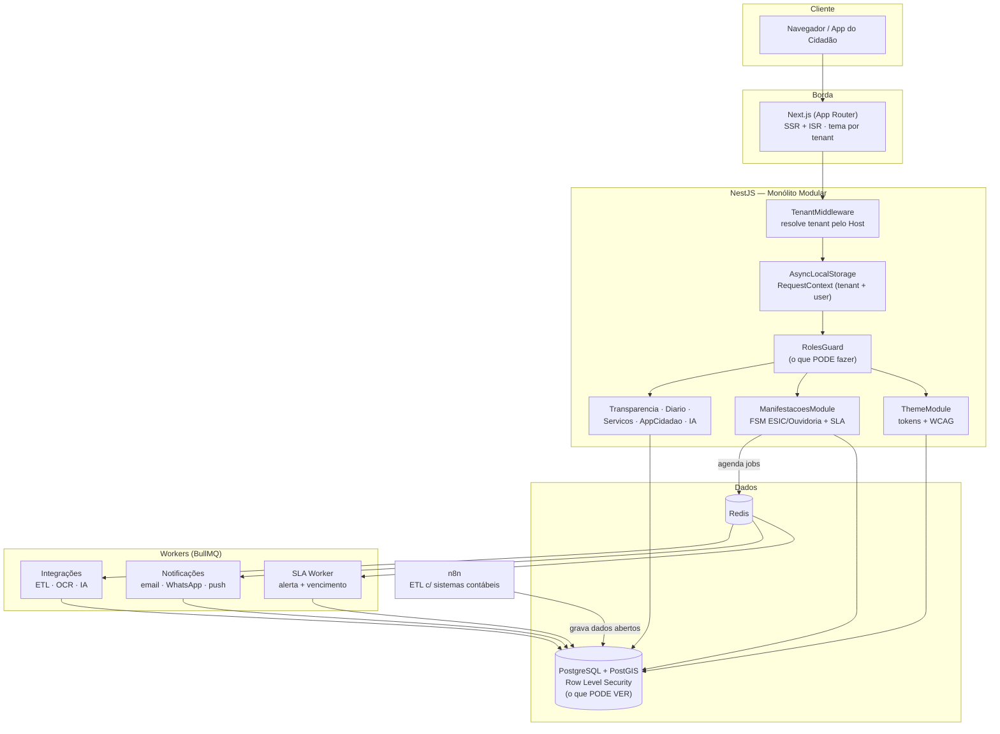

# Portal de Prefeitura — Plataforma SaaS multi-tenant

Plataforma única que serve **N prefeituras**, cada uma com seu domínio, identidade visual e conteúdo, mas compartilhando o mesmo código e a mesma infraestrutura. Este repositório é o **scaffold da fundação** — as quatro camadas que tudo o mais (Transparência, Diário Oficial, Serviços, App do Cidadão, IA) vai reutilizar.

> Stack: **NestJS** (API modular) · **Next.js** (portal SSR/ISR) · **PostgreSQL + PostGIS** (RLS) · **Redis + BullMQ** (assíncrono) · **n8n** (integrações) · **Docker**.

---

## Pacote para desenvolver com o Claude Code

Além do scaffold, o repositório vem preparado para o **Claude Code** implementar os módulos de ponta a ponta. Comece pelo **[`GUIA-CLAUDE-CODE.md`](GUIA-CLAUDE-CODE.md)** e pelo **[`CLAUDE.md`](CLAUDE.md)**.

| Peça | Onde |
|------|------|
| Contexto-mestre (regras invioláveis, fluxo) | `CLAUDE.md` |
| Subagents (arquiteto, backend, frontend, mobile, DBA/RLS, segurança, LGPD, QA, revisor, docs) | `.claude/agents/` |
| Skills (RLS, FSM/SLA, tema/WCAG, gov.br, transparência) | `.claude/skills/` |
| Slash commands (`/nova-feature`, `/migrar-db`, `/auditoria-seguranca`, `/revisar-pr`) | `.claude/commands/` |
| MCP (postgres, filesystem, git, fetch, playwright) | `.mcp.json` |
| Specs por módulo | `specs/` |
| Documentação completa | `docs/` (arquitetura, requisitos, fluxos, segurança, DevSecOps, LGPD/GDPR, banco, mobile, escala, stack, roadmap, ADRs) |
| Infra & CI/CD/DevSecOps | `.github/workflows/`, `infra/` |

---

## Arquitetura



**Duas camadas de segurança independentes e obrigatórias:**

1. **RBAC (`RolesGuard`)** — *o que você pode fazer*. Roles do domínio: `super_admin`, `admin_prefeitura`, `gestor`, `ouvidor`, `servidor`, `cidadao`.
2. **RLS no PostgreSQL** — *o que você pode ver*. Cada requisição define `app.current_tenant_id` numa transação; as *policies* isolam os dados no banco, sem confiar apenas no código.

O tenant é resolvido pelo **Host** (`cuiaba.mt.gov.br` ou `cuiaba.plataforma.com.br`) e propagado por `AsyncLocalStorage`, então nenhum service precisa receber `tenantId` manualmente.

---

## Sequência de construção (ordem de dependência)

As camadas foram montadas nesta ordem porque cada uma sustenta a próxima:

| # | Camada | O que entrega | Arquivos-chave |
|---|--------|---------------|----------------|
| 1 | **Banco + RLS** | Multi-tenancy isolado no banco, PostGIS, auditoria | `db/001`–`db/005` |
| 2 | **Núcleo NestJS** | Contexto de tenant, Prisma com RLS automático, RBAC | `api/src/common/*`, `api/src/prisma/*` |
| 3 | **Motor de temas** | Tokens por tenant + validação WCAG bloqueante + injeção CSS no Next.js | `api/src/modules/theme/*`, `web/*` |
| 4 | **ESIC/Ouvidoria** | Máquina de estados + SLA legal + workers de prazo | `api/src/modules/manifestacoes/*` |
| 5 | **Docker** | Sobe tudo: Postgres, Redis, n8n, API, web | `docker-compose.yml` |

---

## Conformidade legal (o diferencial)

O modelo de dados e os fluxos já nascem ancorados na legislação:

- **Transparência ativa** — LC 131/2009 + LRF (receitas/despesas, licitações, contratos, folha) com exportação em dados abertos.
- **ESIC / acesso à informação** — LAI (Lei 12.527/2011): prazo de **20 dias + 10** de prorrogação e instâncias recursais (modeladas na FSM).
- **Ouvidoria** — Lei 13.460/2017: prazo de **30 dias + 30**; tipos denúncia/reclamação/sugestão/elogio/solicitação.
- **Diário Oficial** — validade jurídica exige assinatura digital ICP-Brasil (módulo futuro).
- **LGPD + Acessibilidade** — Padrão Digital de Governo (Design System gov.br), WCAG 2.1 AA validado no salvamento do tema, VLibras no portal.
- **Identidade** — login do cidadão via **gov.br (Login Único)** previsto no modelo (`users.govbr_sub`).

Os prazos legais ficam em `api/src/modules/manifestacoes/sla.ts` e são configuráveis por tenant (algumas prefeituras adotam prazos mais curtos que o piso legal).

---

## Instalação (manuais detalhados)

Para subir a plataforma em produção, há um **manual de instalação passo a passo por ambiente** em [`docs/instalacao/`](docs/instalacao/) — índice em [`docs/instalacao/README.md`](docs/instalacao/README.md):

| Ambiente | Manual |
|----------|--------|
| **Windows Server** (2019/2022) | [`docs/instalacao/01-windows-server.md`](docs/instalacao/01-windows-server.md) |
| **Linux** (Ubuntu/Debian) | [`docs/instalacao/02-linux.md`](docs/instalacao/02-linux.md) |
| **Docker / Docker Compose** | [`docs/instalacao/03-docker.md`](docs/instalacao/03-docker.md) |
| **Google Cloud (GCP)** + Terraform | [`docs/instalacao/04-gcp.md`](docs/instalacao/04-gcp.md) · [`infra/terraform/gcp/`](infra/terraform/gcp/) |
| **Amazon Web Services (AWS)** + Terraform | [`docs/instalacao/05-aws.md`](docs/instalacao/05-aws.md) · [`infra/terraform/aws/`](infra/terraform/aws/) |

Os scripts **Terraform** provisionam toda a infra de nuvem (compute, banco PostGIS, Redis, storage S3, WAF, secrets). **Nenhum segredo é versionado** — use cofre / Secret Manager.

## Como rodar (desenvolvimento local)

```bash
cp .env.example .env

# sobe banco, redis, n8n, api e web
docker compose up -d

# as migrations em db/*.sql rodam automaticamente na 1ª subida do Postgres.
# para rodar manualmente:
#   for f in db/*.sql; do psql "$DATABASE_URL" -f "$f"; done

# desenvolvimento local (fora do Docker):
cd api && npm install && npm run prisma:generate && npm run start:dev
cd web && npm install && npm run dev
```

Serviços: portal `http://localhost:3000` · API `http://localhost:3001/api` · n8n `http://localhost:5678`.

---

## Estrutura

```
portal-prefeitura/
├── db/                     # migrations SQL (fonte da verdade do RLS)
│   ├── 001_extensions_tenancy_rls.sql
│   ├── 002_auth_rbac.sql
│   ├── 003_theme_cms.sql
│   ├── 004_manifestacoes.sql
│   └── 005_app_cidadao_postgis.sql
├── api/                    # NestJS
│   ├── prisma/schema.prisma
│   └── src/
│       ├── common/         # tenant (AsyncLocalStorage) + RBAC
│       ├── prisma/         # PrismaService com RLS transparente
│       └── modules/        # queue · theme · manifestacoes
└── web/                    # Next.js — tema dinâmico por tenant
```

---

## Próximos módulos (encaixam na fundação existente)

- **Transparência** — ETL via n8n a partir dos sistemas contábeis (a integração mais difícil) → tabelas de dados abertos + API CSV/JSON.
- **Diário Oficial** — publicação imutável com assinatura ICP-Brasil e carimbo de tempo.
- **App do Cidadão** — chamados georreferenciados (já há `chamados` com PostGIS e detecção de duplicados por raio).
- **IA** — triagem automática de manifestações (`JOB_IA_TRIAGEM`), busca semântica (RAG) na transparência, chatbot da Carta de Serviços, OCR de documentos.

> **Nota:** este é um scaffold — a rede de build estava desativada, então as dependências não foram instaladas nem o código foi executado aqui. Rode `npm install` / `docker compose up` no seu ambiente.
