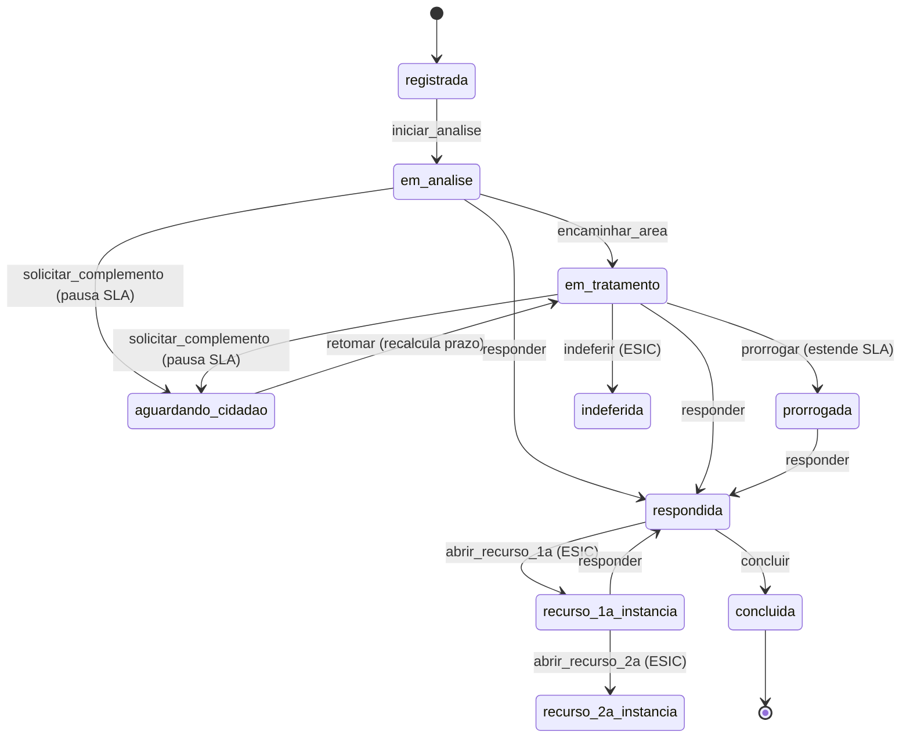
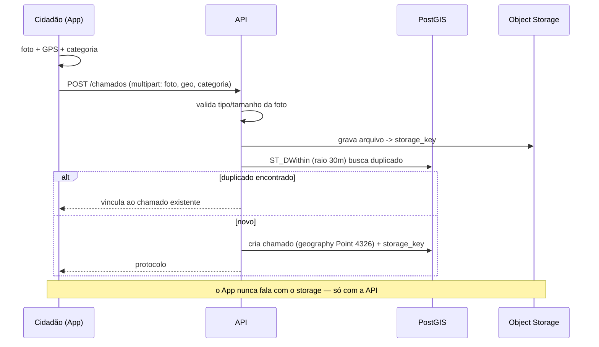
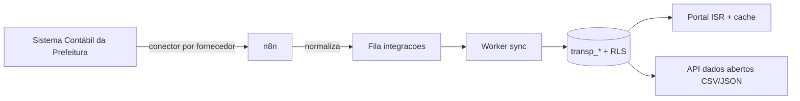

# 03 — Fluxos

## Resolução de tenant + RLS (toda requisição)

```mermaid
sequenceDiagram
    participant C as Cliente
    participant MW as TenantMiddleware
    participant ALS as AsyncLocalStorage
    participant S as Service
    participant P as PrismaService
    participant DB as PostgreSQL (RLS)
    C->>MW: requisição (Host)
    MW->>MW: resolve tenant pelo domínio/subdomínio
    MW->>ALS: run({ tenantId })
    ALS->>S: cadeia segue no contexto
    S->>P: prisma.db.<model>.<op>()
    P->>DB: BEGIN; set_config('app.current_tenant_id', id, true); <query>; COMMIT
    DB-->>P: somente linhas do tenant (policy RLS)
    P-->>C: resposta isolada
```

## Manifestação ESIC/Ouvidoria (estados)



## SLA com filas

```mermaid
sequenceDiagram
    participant S as ManifestacoesService
    participant Q as Fila SLA (BullMQ)
    participant W as SlaWorker
    participant N as Fila Notificações
    participant DB as PostgreSQL
    S->>Q: add(alerta, delay=80% prazo, jobId=sla-alerta-<id>)
    S->>Q: add(vencido, delay=prazo, jobId=sla-vencido-<id>)
    Note over S,Q: idempotente por jobId; reagenda sem duplicar
    Q->>W: dispara no tempo agendado
    W->>DB: status encerrado? (no-op) senão segue
    W->>N: notifica responsável (email/WA)
    W->>DB: grava audit_log
```

## Abertura de chamado (App do Cidadão)



## Transparência (ETL)


