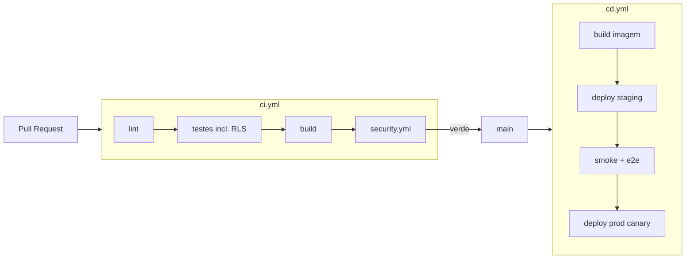

# 05 — DevOps & DevSecOps

## Ambientes

| Ambiente | Propósito | Dados |
|----------|-----------|-------|
| local | desenvolvimento (Docker Compose) | sintéticos |
| dev | integração contínua | sintéticos |
| staging | homologação (espelho de prod) | anonimizados |
| prod | produção | reais |

Configuração por ambiente via variáveis (12-factor). Segredos em cofre (ex.: secrets do provedor / Vault), nunca no repo.

## CI/CD

- **CI** (`.github/workflows/ci.yml`): lint, testes (unit/integração/e2e), **teste de isolamento RLS**, build. Gate: tudo verde.
- **Segurança** (`.github/workflows/security.yml`): SAST (CodeQL/semgrep), SCA (npm audit/Trivy), secret scanning (gitleaks), IaC scan (Checkov/Trivy), scan da imagem. Gate: sem vulnerabilidade alta/crítica sem waiver.
- **CD** (`.github/workflows/cd.yml`): build da imagem → deploy em staging → smoke/e2e → produção em **canary** com rollback automático por métricas.

## Estratégia de deploy

- Imagens versionadas por commit SHA; deploy imutável.
- Migrations de banco aplicadas em passo controlado, **antes** do rollout da app (compatibilidade para trás).
- Canary + health checks; rollback automático se erro/latência subir.

## Observabilidade

- **Logs** estruturados (JSON) com `tenant_id`, `request_id`, `user_id` (sem dado pessoal sensível em claro).
- **Métricas** (Prometheus): latência, throughput, taxa de erro, profundidade de fila, SLA de manifestações (no prazo / vencido), cache hit.
- **Tracing** (OpenTelemetry) ponta a ponta (web → API → DB/fila).
- **Alertas:** fila crescendo, worker falhando (dead-letter), SLA vencendo em massa, erro 5xx, certificado/segredo expirando.

## DevSecOps (princípios)

- Segurança *shift-left*: o desenvolvedor (e o subagent) recebe feedback de segurança no PR, não em produção.
- Tudo como código: infra, pipeline e políticas versionados e revisados.
- Gates objetivos: nada sobe com vulnerabilidade crítica não tratada.
- Auditoria de cadeia de suprimentos: SBOM por release, dependências fixadas e assinadas quando possível.

## Backups & DR

- Backups automatizados do Postgres (PITR) testados periodicamente (restore real).
- Object storage com versionamento.
- RPO/RTO definidos por ambiente; runbooks de recuperação em `infra/`.
