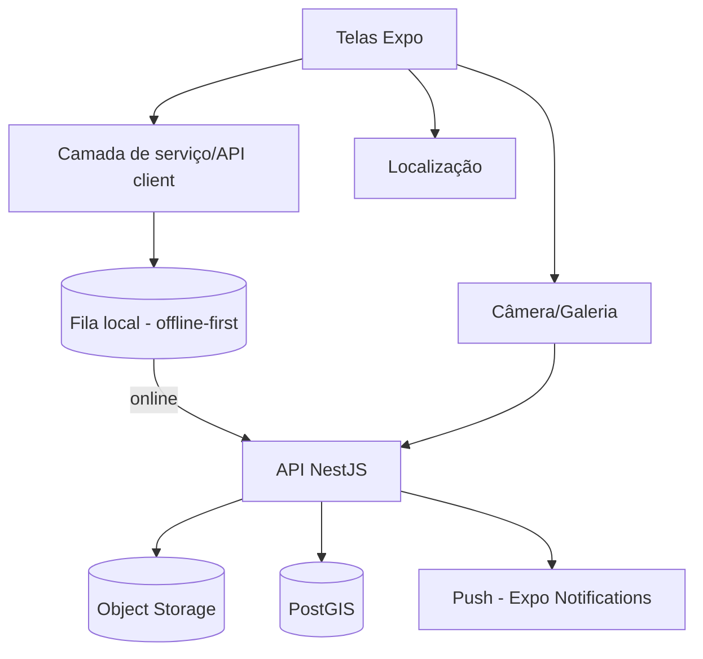

# 08 — Mobile (App do Cidadão)

React Native + **Expo**. Foco: denúncias georreferenciadas e acompanhamento, com login gov.br.

## Funcionalidades

- **Abrir chamado:** categoria (buraco, terreno/animal abandonado, iluminação, lixo, árvore em risco, sinalização, outro) + descrição + **foto** + **GPS/ponto no mapa**.
- **Mapa:** chamados próximos (consulta por raio via PostGIS), com status e cluster.
- **Acompanhamento:** por protocolo, com timeline e **push** de atualização.
- **Identidade:** login gov.br (skill `govbr-login-unico`); ações básicas permitidas sem login, conforme política do tenant.
- **Multi-município:** o cidadão seleciona/realiza o tenant; toda chamada à API carrega o município.

## Arquitetura

> O App fala **apenas** com a API. A foto é enviada à API (multipart) e é a **API** que grava no object storage — o cliente nunca acessa o storage diretamente.

## Decisões

- **Offline-first:** abertura de chamado funciona sem rede; fila local sincroniza ao reconectar (idempotência por id local → protocolo).
- **Fotos:** enviadas à **API** (multipart); é o backend que grava no object storage e devolve a `storage_key`. O app não acessa o storage diretamente.
- **Permissões:** pedir câmera/localização com justificativa clara; degradar com graça se negadas.
- **Acessibilidade:** rótulos, alvo de toque adequado, contraste, suporte a leitor de tela.
- **Build/Distribuição:** EAS Build; canais de release (preview/produção).

## Privacidade

- Localização e foto são dados pessoais potenciais — minimizar, exibir aviso, e permitir denúncia anônima.
- Não embutir segredos no app; tokens de sessão seguros; sem PII em logs.

## Critérios de aceite

Fluxo de abertura de chamado completo (foto+GPS+envio), funcionamento offline, mapa com chamados próximos, push de atualização e teste do caminho principal. Ver `specs/app-cidadao.md`.
