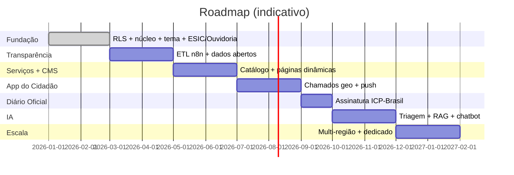

# 11 — Roadmap

Fases em ordem de dependência. Cada fase tem critério de saída objetivo.

## Fase 0 — Fundação ✅ (scaffold entregue)
Multi-tenancy + RLS, núcleo NestJS (tenant/RBAC), motor de temas + WCAG, ESIC/Ouvidoria (FSM + SLA + worker), Docker.
**Saída:** isolamento RLS testado; manifestação registra, transita e dispara SLA; tema bloqueia WCAG.

## Fase 1 — Transparência
ETL via n8n a partir do sistema contábil; modelo canônico `transp_*`; portal ISR; API de dados abertos (CSV/JSON) + dicionário.
**Saída:** receitas/despesas publicadas com defasagem ≤ 24h; exportação e API funcionando; idempotência do ETL provada.

## Fase 2 — Serviços + CMS
Catálogo de serviços (Carta de Serviços), CMS de páginas/blocos, gestão de identidade visual no admin.
**Saída:** prefeitura monta home e páginas sem deploy; serviços publicados com prazos.

## Fase 3 — App do Cidadão
Expo: chamados geo (foto+GPS), mapa, acompanhamento, push, offline-first, login gov.br.
**Saída:** abertura de chamado ponta a ponta; detecção de duplicados; app publicado nas lojas.

## Fase 4 — Diário Oficial
Publicação imutável com assinatura ICP-Brasil + carimbo de tempo; busca e arquivo.
**Saída:** edição assinada e verificável; integridade comprovável.

## Fase 5 — IA
Triagem/classificação de manifestações (com revisão humana), RAG na transparência e Carta de Serviços, chatbot, OCR.
**Saída:** triagem sugerindo roteamento com acurácia medida; chatbot respondendo da base oficial; DPIA aprovado.

## Fase 6 — Escala / Multi-região
Réplicas de leitura, schema dedicado para capitais, multi-região, residência de dados.
**Saída:** SLA de disponibilidade atingido sob carga de teste; promoção de tenant a schema dedicado sem downtime.

## Transversal (todas as fases)
Segurança/DevSecOps no CI, conformidade LGPD/GDPR por feature, acessibilidade, observabilidade e documentação sempre atualizadas.
