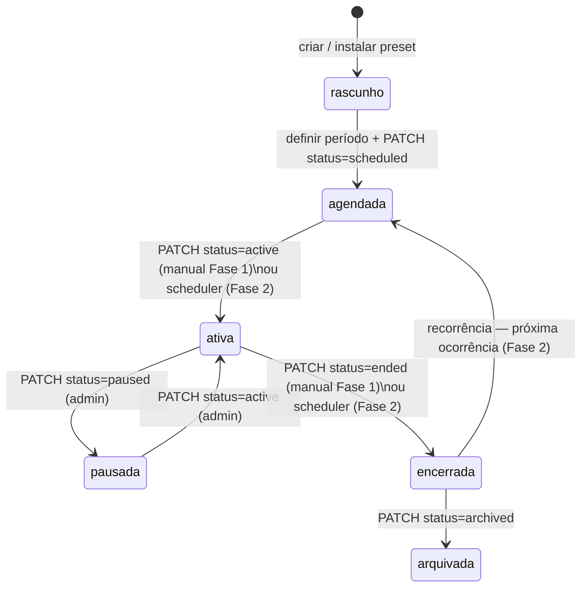
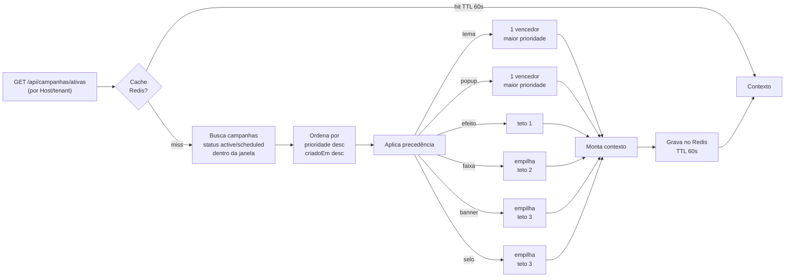

# Módulo Campanhas — Visão Geral

O motor de campanhas permite que cada prefeitura (tenant) ative peças visuais e informativas no portal durante janelas de datas definidas. Uma campanha pode alterar o tema de cores do portal, exibir uma faixa superior, um banner de imagem, um pop-up modal, um efeito interativo, um selo e uma referência a página CMS — tudo a partir de um único objeto `config` validado pelo backend.

A plataforma oferece uma **biblioteca de presets globais** (dengue, Outubro Rosa, IPTU, Copa do Mundo, etc.) que qualquer prefeitura instala com um clique. Após instalado, o preset vira uma campanha do tenant e pode ser customizado à vontade.

## Conceitos fundamentais

| Conceito | Definição |
|----------|-----------|
| **Template (preset)** | Registro global na tabela `campaign_template`, mantido pela plataforma Lidera. Não pertence a nenhum tenant. Serve de ponto de partida com cores, textos e períodos sugeridos. |
| **Campanha** | Instância em `campaign` criada a partir de um preset (ou do zero) para um tenant específico. Tem status próprio, janela de datas, prioridade e `config` que pode sobrescrever o preset. |
| **Capacidade** | Uma "peça" que uma campanha pode ligar: `tema`, `faixa`, `banner`, `popup`, `pagina`, `efeito`, `selo`. Cada capacidade tem seu schema validado no backend. Ausência da chave = desabilitada. |
| **Resolver** | Endpoint `GET /api/campanhas/ativas` que, em tempo de requisição, filtra as campanhas efetivas do tenant, aplica as regras de precedência/conflito e devolve um contexto pronto para o frontend renderizar. Resultado em cache Redis TTL 60s. |
| **Scheduler** | Job BullMQ que transita estados automaticamente (`scheduled → active → ended`) e gerencia recorrência. Implementado na **Fase 2**; na Fase 1 as transições são manuais via PATCH. |

## Escopo das fases

**Fase 1 (Fundação) — implementada**

- Migration `084` com 3 tabelas + RLS.
- Registro de capacidades com validação Zod-like no backend (incluindo guard WCAG AA para tema).
- CRUD admin: biblioteca, instalar preset, criar/editar/ligar/desligar/excluir campanha.
- Resolver `GET /api/campanhas/ativas` com cache Redis e precedência determinística.
- Seeds da biblioteca global (28 presets: meses coloridos, sazonais, operacionais, cívicos).
- Frontend público: `CampanhaRenderer` com faixa, popup, efeito (registry plugável), selos e override de tema via CSS vars.
- Painel admin `/admin/campanhas`: biblioteca filtrável, lista de campanhas, editor completo com todas as capacidades.

**Fase 2 (Scheduler autônomo — futura)**

- Job BullMQ repetível para transição `scheduled → active → ended`.
- Recorrência anual: rola a próxima ocorrência ao encerrar.
- Sazonal por intervalo de MM-DD (dengue, agasalho, queimadas).
- `autonomous = true`: a campanha entra e sai sozinha, sem ação manual.
- Despublicação automática da página CMS (`pagina.autoDespublica`).
- Capacidade `broadcast` (push / WhatsApp / e-mail com opt-in LGPD).

O campo `recorrencia` e a flag `autonomous` já existem nas tabelas desde a Fase 1 — apenas o código que as consome fica para a Fase 2.

## Ciclo de vida (FSM)

Estados válidos: `draft` | `scheduled` | `active` | `paused` | `ended` | `archived`.

O resolver considera **ativas** as campanhas com status `active` ou `scheduled` cuja janela de datas contém o momento atual. Status `paused`, `draft`, `ended` e `archived` nunca aparecem no contexto público.

## Resolver — fluxo de precedência

Toda mutação (criar, atualizar, ligar/desligar, instalar) invalida o cache via `cache.del('campanhas:ativas:<tenantId>')`.

## Onde está o código

| Camada | Localização |
|--------|-------------|
| Migration SQL + RLS | `db/084_campanhas.sql` |
| Módulo NestJS | `api/src/modules/campanhas/` |
| Validação de capacidades | `api/src/modules/campanhas/capabilities/validator.ts` |
| Guard WCAG AA | `api/src/modules/campanhas/capabilities/wcag.ts` |
| Seeds da biblioteca | `api/src/modules/campanhas/seeds/biblioteca.ts` |
| Renderer público | `web/components/campanhas/CampanhaRenderer.tsx` |
| Efeitos plugáveis | `web/components/campanhas/efeitos/` |
| Painel admin | `web/app/admin/campanhas/page.tsx` |
| Contrato técnico Fase 1 | `docs/campanhas/CONTRATO-fase1.md` |

## Leitura complementar

- `docs/campanhas/modelo-dados.md` — tabelas, RLS, índices, models Prisma
- `docs/campanhas/capacidades.md` — schema de cada capacidade e params dos efeitos
- `docs/campanhas/endpoints.md` — contrato HTTP admin + resolver, exemplos
- `docs/campanhas/catalogo-seed.md` — presets semeados, como rodar `_semear`
- `docs/campanhas/runbook.md` — operação dia a dia e como adicionar novo efeito
- `docs/campanhas/acessibilidade-lgpd.md` — WCAG AA, LGPD, aviso eleitoral
- `docs/campanhas/adr/` — decisões de arquitetura
