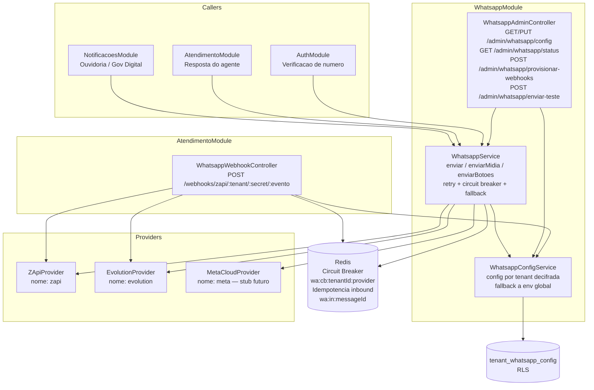

# Adapter de WhatsApp — Visao Geral

> Documentacao gerada a partir do codigo implementado em `api/src/modules/whatsapp/` e da migracao `db/052_whatsapp_provider.sql`. Descreve o que esta em producao; o que for planejado esta marcado como **[futuro]**.

---

## Por que um adapter

O portal usava a Evolution API diretamente. Ambas as opcoes disponiveis no mercado (Evolution e Z-API) sao **nao oficiais** — baseadas em QR Code, sujeitas a banimento e com historico de instabilidade. Acoplar o sistema a um unico provider significa que uma queda de instancia derruba notificacoes de protocolo, atendimento e autenticacao de todos os tenants.

A decisao foi colocar o WhatsApp **atras de uma interface de provider** com:

- **Retry** exponencial por envio (2 tentativas com backoff de 800 ms).
- **Circuit breaker por tenant/provider** em Redis (5 falhas em 2 min abre o breaker por 1 min).
- **Fallback automatico** para o provider secundario quando o primario tem o breaker aberto.
- **Troca de provider sem reescrita** — os callers (Ouvidoria, Atendimento, Auth) chamam `WhatsappService`; nunca a Z-API ou Evolution diretamente.

O caminho para a **API oficial da Meta** (gratuita, com assinatura HMAC) esta preparado via `MetaCloudProvider` (stub) sem retrabalho no resto do sistema.

---

## Arquitetura

### Componentes

| Componente | Arquivo | Responsabilidade |
|---|---|---|
| `WhatsappProvider` | `whatsapp-provider.interface.ts` | Contrato de todos os providers |
| `ZApiProvider` | `zapi.provider.ts` | Implementacao Z-API (provider primario atual) |
| `EvolutionProvider` | `evolution.provider.ts` | Implementacao Evolution (fallback) |
| `MetaCloudProvider` | `meta-cloud.provider.ts` | Stub — nao implementado |
| `WhatsappService` | `whatsapp.service.ts` | Adapter publico: retry, circuit breaker, fallback, auditoria |
| `WhatsappConfigService` | `whatsapp-config.service.ts` | Config por tenant: leitura/gravacao cifrada, fallback a env |
| `WhatsappWebhookController` | `whatsapp-webhook.controller.ts` | Webhook de entrada, registrado no `AtendimentoModule` |
| `WhatsappAdminController` | `whatsapp-admin.controller.ts` | Console admin, RBAC `ADMIN_PREFEITURA` |

### Por que o webhook esta no AtendimentoModule

O `WhatsappModule` exporta `WhatsappService` e `WhatsappConfigService`. O webhook de entrada e um concern de Atendimento (cria conversas, persiste mensagens, enfileira jobs). Registrar o controller no `AtendimentoModule` evita dependencia circular e mantem a direcao: `Atendimento → Whatsapp`, nunca o contrario.

O `AtendimentoModule` ainda registra um `WebhookEvolutionController` legado (rota propria). Os dois controllers coexistem; o `WhatsappWebhookController` e o ponto de entrada para o adapter multi-provider.

---

## Quem usa

| Modulo | O que faz | Metodo chamado |
|---|---|---|
| `NotificacoesModule` | Dispara notificacao de protocolo ESIC/Ouvidoria ao cidadao | `enviar(numero, texto)` |
| `AtendimentoModule` | Envia resposta do agente ao cidadao via WhatsApp | `enviar` / `enviarMidia` |
| `AuthModule` | Verificacao de numero de telefone (codigo SMS via WA) | `enviar` |
| `WhatsappWebhookController` | Recebe mensagem do cidadao → cria/continua conversa | — (entrada) |

Nenhum caller fala com Z-API ou Evolution diretamente.

---

## Regras inviolaveis

1. **Apenas o backend fala com o provider.** Frontend e app mobile nunca acessam a Z-API.
2. **Segredos cifrados em repouso.** Tokens gravados como `_cifrado` (AES-256-GCM via `secret-box.util`). Nunca retornados em claro pela API; nunca logados.
3. **Multi-tenant + RLS.** `tenant_whatsapp_config` tem RLS via `app_enable_tenant_rls`. Cada prefeitura tem sua propria instancia Z-API.
4. **Idempotencia por `messageId`.** Mensagens inbound deduplicadas em Redis (TTL 24 h, chave `wa:in:{messageId}`).
5. **Numero mascarado na auditoria.** `audit_log` grava apenas os ultimos 4 digitos do numero (`••••XXXX`); nunca o conteudo da mensagem.
6. **Webhook protegido por path-secret.** A Z-API nao assina o payload; a protecao e feita por `zapiWebhookSecret` no path + `timingSafeEqual` + allowlist de IP na borda (Cloudflare).

---

## Estado atual (Exemplolandia / ambiente Lidera)

- `WHATSAPP_PROVIDER=zapi`, `WHATSAPP_FALLBACK_PROVIDER=evolution` definidos via env global.
- `ZAPI_INSTANCE_ID` e `ZAPI_TOKEN` configurados via env.
- `ZAPI_CLIENT_TOKEN` **vazio** — preencher se a conta Z-API exigir "Seguranca da conta".
- Numero **ainda nao conectado** (QR pendente).
- Webhooks **nao provisionados** no painel Z-API (ver runbook).

Consulte `docs/whatsapp-zapi/runbook.md` para o passo a passo de ativacao.
