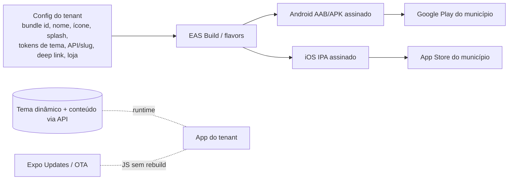

# Mapa do App do Cidadão (referência das 50 telas)

Inventário consolidado a partir do app de referência (Cuiabá Smart + Portal SORP) e como mapeia para o nosso app multi-tenant. Apoio ao `PROMPT-app-cidadao.md`. **Inspiração de leiaute/funcionalidade — não cópia** (identidade vem dos tokens de cada prefeitura).

## Navegação principal
Início · Serviços · Denúncias/Ouvidoria · Notícias · Painel do Cidadão · Configurações. Pilha de autenticação à parte. Header com brasão + nome do tenant, busca e sino de notificações; menu lateral (Início, Serviços, Transparência, Notícias, Cartilha de Serviços, Registrar Denúncia, Consultar Protocolo, Institucional, Entrar/Cadastrar).

## Telas por área

**Autenticação:** Login (e-mail + senha, "Esqueceu a senha?"), **2FA por e-mail** (código após login), Cadastro (nome, e-mail, telefone, senha + confirmar, aceite de Política de Privacidade/Termos), Recuperar Senha (envia link que expira em ~30 min) → Nova Senha, banner "Verifique seu e-mail".

**Início:** saudação personalizada + clima; **Serviços em Destaque** (cards ilustrados: buracos, cata-treco, alagamentos…); **Mais Serviços** (carrossel de banners — IPTU, mutirão, dengue); grade de **categorias** (Saúde, Infraestrutura/Acessibilidade, Notícias, Turismo, Telefones Úteis, Mobilidade/Segurança, Vagas de Emprego, Festas e Eventos, Avalie a Administração); **Links Úteis** (IPTU, Multas e Recursos, Ouvidoria, Segurança Pública, Cidade em Dados).

**Solicitação de Serviços (demandas urbanas):** catálogo (Mutirão de Limpeza, Poda e Erradicação, Equipamentos/Materiais abandonados, Falta de sinalização em obras, Galeria de águas pluviais, Buracos em Ruas e Avenidas, Capinagem e Roçagem, Alagamentos, Cata-Treco, Ruas sem asfalto, Iluminação Pública, Infraestrutura e Acessibilidade, Mobilidade e Segurança…). **Alguns itens abrem o discador** (telefone) em vez de formulário.

**Denúncias / Ouvidoria (SORP):** hero "Disponível 24h", busca, **Registrar Denúncia**, **Consultar Protocolo**, Entrar/Criar conta, métricas (registradas, taxa de resolução, tempo médio, 24/7), Serviços para você, Notícias e Comunicados, alerta de não duplicar denúncia.

**Painel do Cidadão:** Minhas Denúncias (status "Em dia"), Registrar Denúncia, Agendamentos, Alvará/Licenças ("Em breve"). **Detalhe da denúncia:** Assunto, **status** (ex.: FINALIZADA), **protocolo**, Data de Registro, **Localização**, Descrição e **Histórico de Trâmites** (timeline com data/hora por marco) + **Avaliar atendimento**.

**Notícias:** lista (imagem, categoria, "Leia mais") + busca + detalhe.

**Notificações:** lista + empty state; push por tipo (Geral, Alertas, Publicações, Eventos, Previsão do Tempo).

**Configurações:** tema claro/escuro, toggles de notificação por tipo, Ajuda, Sobre o app/desenvolvedor, Política de privacidade, Avaliar o app.

**Acessibilidade (presente em todo o app):** redimensionar fonte, alto contraste, "pular para conteúdo", equivalente a VLibras; consentimento de cookies/privacidade.

## Variantes de formulário (modelar como "tipos de solicitação")
1. **Completo:** Localização*, Descrição*, anexos (limite **0/1**), **Dados do Solicitante** (Tipo de pessoa PF/PJ, Nome ou Razão Social*, Endereço, Telefone*, E-mail*).
2. **Com Assunto:** igual ao completo + **dropdown "Assunto"** antes da descrição.
3. **Simples:** Nome*, Endereço*, anexos (limite **0/5**), "Descreva o problema/dúvida/solicitação"*.
4. **Telefônico:** sem formulário — abre o discador (ex.: Infraestrutura e Obras, Zeladoria/LIMPURB).

> Cada tipo deve ter **limite de anexos configurável**, **campos configuráveis** e **categoria/assunto** definidos por tenant.

## Fluxo: denúncia/serviço com foto + GPS → Ouvidoria

```mermaid
sequenceDiagram
    participant APP as App (cidadão)
    participant API
    participant MID as Biblioteca de mídia (restrita)
    participant DB as PostGIS
    participant Q as Fila (SLA + notificações)
    APP->>APP: escolhe categoria (buraco, terreno baldio, dengue…)
    APP->>API: envia descrição + foto(s) + GPS (multipart) [anônimo?]
    API->>MID: grava foto como RESTRITA (sem URL pública)
    API->>DB: cria manifestação (canal ouvidoria) + ponto geográfico + checa duplicado por raio
    API->>DB: gera PROTOCOLO
    API->>Q: agenda SLA + notifica responsável
    API-->>APP: protocolo (+ chave, se anônimo)
    Note over APP,API: acompanhamento: anônimo por protocolo;<br/>logado pelo Painel do Cidadão; timeline de trâmites
```

## Pipeline white-label (um app, N APKs)



Marca estática (ícone, splash, nome, bundle id, ficha de loja) é "baked" por build; **tema (tokens) e conteúdo** podem vir da API em runtime. Trocar cor → sem rebuild; trocar ícone/nome/bundle → exige rebuild.
