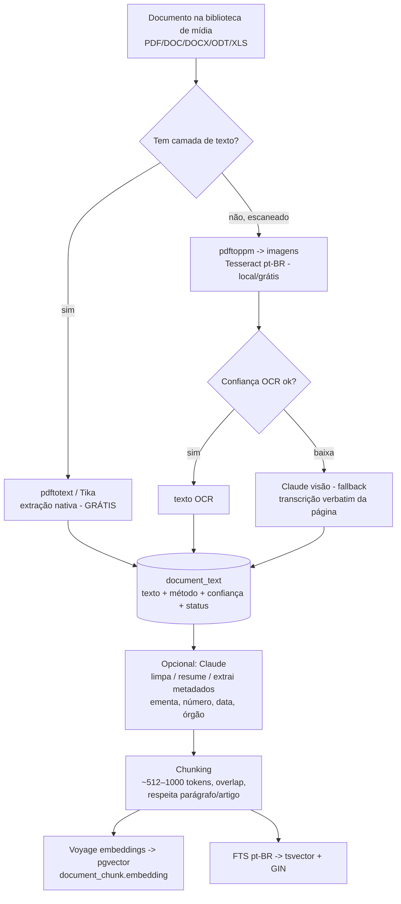
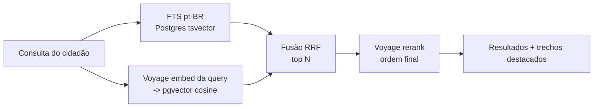

# Arquitetura — Extração + Busca semântica de documentos

Apoio ao `PROMPT-extracao-busca-documentos.md`. Toolchain: **Tesseract** (OCR local) + **Claude API** (visão/limpeza, fallback) + **VoyageAI** (embeddings + rerank) + **pgvector** no Postgres existente. **Sem banco novo.** Tudo por tenant (RLS).

## Pipeline de extração (worker)



**Camadas por custo (ordem importa):** nativo (grátis) → Tesseract (local/grátis) → Claude visão (pago, só fallback). **Embedda uma vez**; re-embedda só quando o texto muda.

## Gatilhos (mesma fila BullMQ, idempotente)
- **No upload** (automático): enfileira após criar/atualizar o arquivo do documento.
- **Backfill em massa** (fase inicial): comando/endpoint que enfileira **todos** os documentos existentes — paginado, throttled, **resumível**, pula o que já tem texto do mesmo hash.
- **Botão no admin** (fase seguinte): `POST /api/documentos/:id/extrair` (re-extrair/forçar).
- Job `document:extract` com chave `documentId + sourceHash` (idempotente). `document:embed` separado, para re-embeddar sem re-OCR.
- Respeitar **rate limits** de Claude e Voyage (backoff); a trilha nativa não deve ser limitada por API.

## Busca híbrida + rerank



- **Isolamento por tenant** em toda busca (RLS + filtro explícito `tenantId`).
- **Respeitar nível de acesso** do documento (não retornar restrito ao público).
- Expor `GET /api/busca?q=...` (global) e busca por módulo (legislação etc.), com snippets.

## Esquema (Prisma + pgvector + RLS) — esboço

```prisma
model DocumentText {
  id          String   @id @default(cuid())
  tenantId    String   @map("tenant_id")
  documentId  String   @unique @map("document_id")
  text        String   // texto completo
  method      String   // native | tesseract | claude_vision
  confidence  Float?   // confiança média do OCR
  status      String   // pending | extracted | failed | needs_review
  language    String?  // por
  sourceHash  String   @map("source_hash")
  extractedAt DateTime @default(now()) @map("extracted_at")
  @@map("document_text")
}

model DocumentChunk {
  id          String   @id @default(cuid())
  tenantId    String   @map("tenant_id")
  documentId  String   @map("document_id")
  chunkIndex  Int      @map("chunk_index")
  content     String
  tokens      Int?
  // embedding vector(N) e tsv tsvector criados via SQL/migração (Prisma não tem tipo nativo)
  createdAt   DateTime @default(now()) @map("created_at")
  @@map("document_chunk")
}
```

Na **migração SQL** (o Prisma não modela `vector`/`tsvector`):
```sql
CREATE EXTENSION IF NOT EXISTS vector;
ALTER TABLE document_chunk ADD COLUMN embedding vector(1024);   -- N = dimensão do modelo Voyage
ALTER TABLE document_chunk ADD COLUMN tsv tsvector;
CREATE INDEX ON document_chunk USING hnsw (embedding vector_cosine_ops);
CREATE INDEX ON document_chunk USING gin (tsv);
CREATE INDEX ON document_chunk (tenant_id, document_id);
-- RLS em document_text e document_chunk (tenant_id = current_setting('app.current_tenant_id'))
```

> **Gotcha crítico:** a **dimensão** da coluna `vector(N)` precisa casar com a do **modelo Voyage** escolhido. Trocar de modelo com outra dimensão = **migração + re-embeddar tudo**. Deixe o modelo/dimensão em config e documente.

## Config (placeholders — não commitar)
```dotenv
ANTHROPIC_API_KEY=__secret__
ANTHROPIC_MODEL=__confirmar_modelo_atual__     # visão/limpeza; usar ZDR se disponível
VOYAGE_API_KEY=__secret__
VOYAGE_EMBED_MODEL=__multilingue_geral__       # testar modelo jurídico no acervo
VOYAGE_EMBED_DIM=1024                           # DEVE casar com vector(N)
VOYAGE_RERANK_MODEL=__rerank_atual__
OCR_LANG=por
OCR_TEXT_DENSITY_MIN=__limiar__                 # nativo vs OCR
OCR_TESSERACT_CONF_MIN=__limiar__              # abaixo -> fallback Claude visão
```

## Notas de conformidade
- **Só-API** (worker é backend), **RLS/tenant** em texto e chunks, busca filtrada por tenant + nível de acesso.
- **LGPD:** Claude e Voyage **processam o conteúdo** → usar **ZDR/retenção zero** onde houver; docs públicos OK; **não** enviar documento **restrito** a API externa sem avaliar; minimizar (mandar só o necessário).
- **Original é a fonte de verdade**; marcar texto OCR/IA como *"extraído automaticamente, pode conter imprecisões"*. Acessível (leitor de tela).
- **Auditoria** da extração (método + quem acionou).
