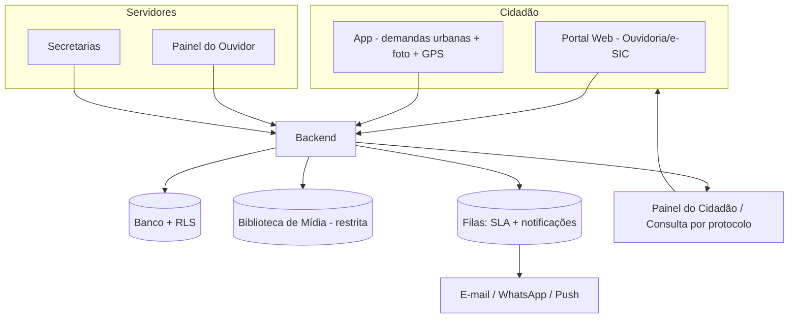
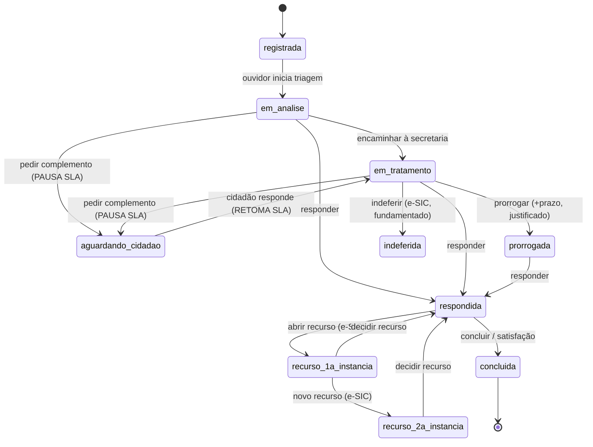
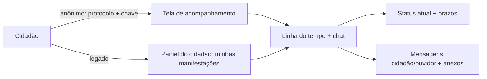
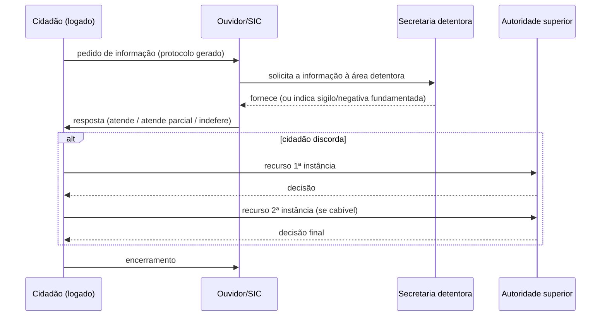
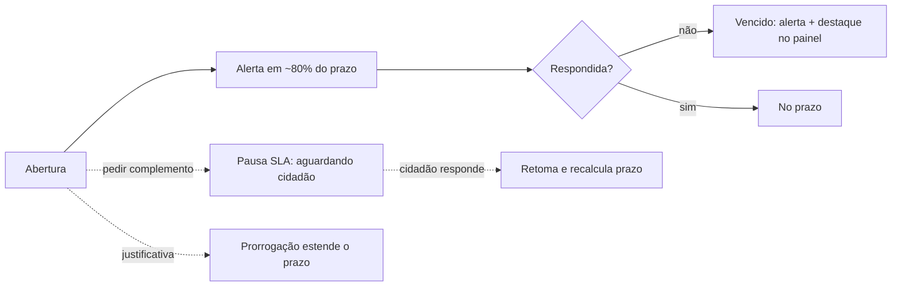
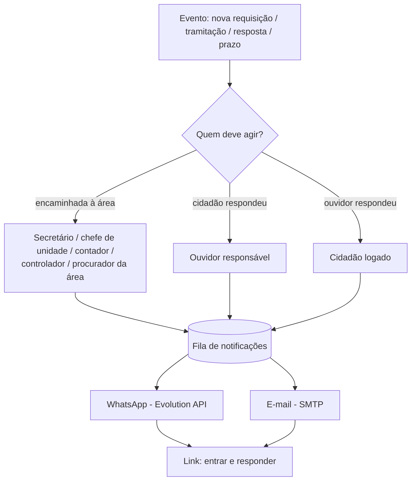

# Fluxo Completo — Sistema de Ouvidoria e e-SIC

Como funciona, de ponta a ponta, um sistema de **Ouvidoria** (Lei 13.460/2017) e **e-SIC / Acesso à Informação** (LAI, Lei 12.527/2011) num portal público municipal. Serve de base para o desenvolvimento (ver `PROMPT-ouvidoria-esic.md`).

## 1. Os dois canais (semelhantes, mas distintos)

| | **Ouvidoria** | **e-SIC (Acesso à Informação)** |
|---|---|---|
| Base legal | Lei 13.460/2017 | LAI 12.527/2011 + Decreto 7.724/2012 |
| O que é | Reclamação, denúncia, crítica, sugestão, elogio, solicitação | Pedido de **informação pública** |
| Anonimato | **Permitido** (especialmente denúncia) | **Não** — exige identificação do solicitante |
| Acesso | Portal e **app** (com foto + geolocalização nas demandas urbanas) | Somente **cidadão logado** |
| Prazo | **30 dias + 30** de prorrogação | **20 dias + 10** de prorrogação |
| Recurso | Reanálise/2ª instância administrativa | **Recurso 1ª e 2ª instância** (autoridade superior) |
| Quem responde | **Ouvidor** (tramita com as secretarias) | **Ouvidor/SIC** busca a informação nas áreas e repassa |
| Extras | Pesquisa de satisfação | Classificação de sigilo |
| Acompanhamento | Protocolo (anônimo) **ou** painel do cidadão (logado) | Painel do cidadão (sempre logado) + protocolo |

## 2. Atores

- **Cidadão (anônimo)** — abre manifestação de ouvidoria sem se identificar; acompanha **só pelo protocolo**.
- **Cidadão (logado)** — cadastra **WhatsApp + e-mail**; abre ouvidoria e e-SIC; acompanha tudo no **painel do cidadão** e é avisado a cada resposta.
- **Ouvidor** — faz login; o sistema o reconhece pela role e libera o **painel do ouvidor**; tria, encaminha às áreas, responde, conclui.
- **Áreas internas (servidores responsáveis)** — recebem o encaminhamento e fornecem a informação/providência. Incluem: **secretário(a)**, **chefe de departamento / unidade**, **contador(a)**, **controlador(a) interno(a)**, **assessor(a) / procurador(a) jurídico(a)**. Cada um cadastra **WhatsApp + e-mail** e é avisado quando algo cai na sua área.
- **Autoridade superior** — julga recursos do e-SIC.
- **Sistema** — gera protocolo, controla prazos (SLA), **notifica por WhatsApp + e-mail**, audita.

Todo usuário interno e o cidadão logado têm **contatos cadastrados e verificados** (WhatsApp e e-mail) com preferências de notificação.

## 3. Visão geral



## 4. Tipos de manifestação

**Ouvidoria (geral):** reclamação · denúncia · crítica · sugestão · elogio · solicitação.

**Ouvidoria (demandas urbanas — web e app, com foto + GPS):** terreno baldio · foco de dengue · buraco na via · barulho/perturbação · iluminação pública · lixo/entulho · animal abandonado · poda de árvore · outros. (Categorias configuráveis por prefeitura.)

**e-SIC:** pedido de acesso à informação (com possibilidade de classificação de sigilo e recursos).

## 5. Ciclo de vida (máquina de estados)



> Ouvidoria e e-SIC compartilham a mesma máquina; **recursos** (1ª/2ª instância) só se aplicam ao **e-SIC**. A pesquisa de **satisfação** é da Ouvidoria.

## 6. Abertura + protocolo

```mermaid
sequenceDiagram
    participant C as Cidadão (web/app)
    participant API
    participant DB
    participant Q as Fila SLA
    C->>API: abrir manifestação (tipo, texto, [foto+GPS], anônima?)
    API->>API: valida; se demanda urbana, processa foto (via biblioteca de mídia, restrita) e geo
    API->>DB: cria manifestação + gera PROTOCOLO único
    API->>Q: agenda alerta (80% do prazo) e vencimento
    API-->>C: protocolo + (anônimo) chave de acompanhamento
    Note over C,API: anônimo acompanha só com o protocolo;<br/>logado acompanha pelo painel
```

**Formato do protocolo:** `AAAA.SEQ.DV` por prefeitura/ano (ex.: `2026.000123.45`). Recomenda-se um componente não sequencial ou uma **chave de acompanhamento** para o caso anônimo, evitando que terceiros adivinhem protocolos e leiam conteúdo com dado pessoal.

## 7. Acompanhamento



## 8. Tramitação em chat (cidadão ↔ ouvidor)

```mermaid
sequenceDiagram
    participant C as Cidadão
    participant OUV as Ouvidor (painel)
    participant SEC as Secretaria
    C->>OUV: mensagem inicial (manifestação)
    OUV->>OUV: triagem, classifica, define prazo
    OUV->>SEC: encaminhamento interno (pedido de providência/informação)
    SEC-->>OUV: resposta da área
    OUV->>C: mensagem de resposta (data/hora, anexos)
    C->>OUV: réplica / complemento
    OUV->>C: conclusão + (ouvidoria) pesquisa de satisfação
    Note over C,OUV: thread contínua, cada mensagem com autor, data/hora e arquivos;<br/>mudanças de status aparecem na mesma linha do tempo
```

A tela de tramitação é um **chat contínuo**: cada item tem autor (cidadão / ouvidor / sistema), data e hora, texto e anexos; os eventos de status (encaminhada, prorrogada, respondida…) aparecem intercalados como marcos. Atualização em tempo real (websocket) ou por atualização periódica.

## 9. e-SIC — particularidades



O **ouvidor/SIC** é o ponto único: recebe o pedido, **busca a informação** com as secretarias detentoras e devolve ao cidadão. Pedidos de e-SIC **exigem identificação** (cidadão logado) e geram **protocolo**.

## 10. SLA e prazos



Prazos: **Ouvidoria 30+30**, **e-SIC 20+10**, **recurso e-SIC** decidido em 5 dias. Dias úteis/corridos e feriados conforme regra de cada prefeitura. O sistema agenda **alerta** (80%) e **vencimento**, pausa quando aguarda o cidadão e reagenda na retomada.

## 11. Demandas urbanas (app) — foto + geolocalização

```mermaid
sequenceDiagram
    participant C as Cidadão (app)
    participant API
    participant DB as PostGIS
    C->>C: escolhe categoria (buraco, dengue, terreno baldio, barulho…)
    C->>API: envia foto (multipart, via backend) + GPS + descrição
    API->>DB: verifica duplicado por raio (ST_DWithin)
    alt já existe perto
        API-->>C: vincula à ocorrência existente
    else nova
        API->>DB: cria com ponto geográfico + protocolo
        API-->>C: protocolo
    end
    Note over C,API: foto vai à biblioteca de mídia como RESTRITA;<br/>o app nunca acessa storage direto
```

## 12. Notificações multicanal (WhatsApp + e-mail)

Cada usuário (cidadão logado e todos os internos) cadastra e **verifica** WhatsApp e e-mail e define preferências. A cada **nova requisição** ou **tramitação**, o sistema avisa **quem precisa agir** por **WhatsApp** (via Evolution API) **e e-mail**, com um **link seguro para entrar na plataforma e responder**.



**Matriz de notificação (evento → destinatário → canais):**

| Evento | Destinatário | Canais |
|--------|--------------|--------|
| Nova manifestação/pedido registrado | Ouvidor (fila) | WhatsApp + e-mail |
| Encaminhada a uma área | Responsável da área (secretário/chefe/contador/controlador/procurador) | WhatsApp + e-mail |
| Cidadão respondeu / complementou | Ouvidor (e área, se aberta) | WhatsApp + e-mail |
| Ouvidor/área respondeu | Cidadão logado | WhatsApp + e-mail (anônimo: canal informado, se houver) |
| Prazo em ~80% / vencido | Ouvidor + responsável da área | WhatsApp + e-mail |
| Recurso (e-SIC) | Autoridade superior | WhatsApp + e-mail |
| Conclusão / satisfação | Cidadão logado | WhatsApp + e-mail |

**Conteúdo seguro (LGPD):** a mensagem **não** traz o teor nem dados pessoais do cidadão — só o **protocolo**, o **tipo de ação esperada** ("você tem uma nova tramitação para responder") e o **link** para login. O conteúdo só aparece dentro da plataforma, após autenticação.

**Regras:** opt-in com **verificação** do número/e-mail (código único); respeito ao **opt-out**; envio assíncrono pela **fila** com **retry**; **fallback** para e-mail se o WhatsApp falhar; no app, também **push**. Anônimo recebe apenas se informou um canal de contato.

## 13. Conformidade

- **LGPD:** denúncia anônima de verdade; minimização; fotos/geo são dados restritos (sem URL pública); log de acesso; retenção por finalidade.
- **Transparência:** relatórios estatísticos (quantidade, prazos médios, taxa de resposta) alimentam o PNTP e a Lei 13.460 (relatório anual de ouvidoria) e a LAI (relatório de pedidos de acesso).
- **Auditoria:** toda transição e acesso a dado restrito ficam registrados.
